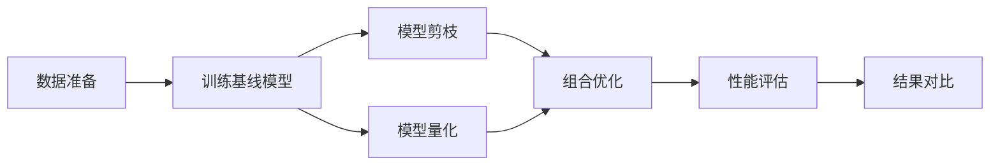

# Transformer 模型剪枝和量化课程设计项目

<div align="center">

[](https://www.python.org/downloads/)
[](https://pytorch.org/)
[](https://opensource.org/licenses/MIT)

一个完整的 Transformer 模型剪枝和量化的课程设计项目，包含理论实现、实验代码和详细文档。

[功能特性](#功能特性) •
[快速开始](#快速开始) •
[项目结构](#项目结构) •
[使用文档](#使用文档) •
[实验结果](#实验结果)

</div>

---

## 📋 目录

- [项目简介](#项目简介)
- [功能特性](#功能特性)
- [快速开始](#快速开始)
  - [环境要求](#环境要求)
  - [安装步骤](#安装步骤)
  - [运行示例](#运行示例)
- [项目结构](#项目结构)
- [使用文档](#使用文档)
- [核心模块](#核心模块)
- [实验流程](#实验流程)
- [实验结果](#实验结果)
- [技术细节](#技术细节)
- [常见问题](#常见问题)
- [贡献指南](#贡献指南)
- [许可证](#许可证)
- [致谢](#致谢)

---

## 🎯 项目简介

本项目是一个完整的 Transformer 模型剪枝和量化的教学和研究项目，旨在帮助学习者深入理解模型压缩技术，并提供可直接运行的实验代码。

### 核心目标

1. **教学目的**：提供清晰的中文文档和注释，帮助理解剪枝和量化技术
2. **实践导向**：包含完整的实验脚本，可直接运行和修改
3. **可复现性**：提供详细的配置文件和实验报告模板
4. **可扩展性**：模块化设计，易于扩展新的方法

### 适用场景

- 🎓 课程设计和毕业设计
- 📚 深度学习模型压缩学习
- 🔬 模型压缩技术研究
- 💼 实际项目的模型优化

---

## ✨ 功能特性

### 模型剪枝

- ✅ **结构化剪枝**
  - 注意力头剪枝（Attention Head Pruning）
  - FFN 神经元剪枝
  - 基于重要性的剪枝策略

- ✅ **非结构化剪枝**
  - 幅度剪枝（Magnitude Pruning）
  - L1/L2 范数剪枝
  - 全局和局部剪枝策略
  - 支持多种稀疏度（10% - 90%）

- ✅ **渐进式剪枝**
  - 迭代式剪枝
  - 自动稀疏度调度
  - 微调恢复性能

### 模型量化

- ✅ **训练后量化 (PTQ)**
  - 动态量化（Dynamic Quantization）
  - 静态量化（Static Quantization）
  - INT8 量化支持

- ✅ **量化感知训练 (QAT)**
  - 伪量化训练
  - INT8/FP16 支持
  - 性能恢复训练

- ✅ **混合精度量化**
  - 层敏感度分析
  - 自动混合精度配置
  - 模型大小估算

### 工具和评估

- 📊 **性能评估**
  - 准确率、F1 分数、精确率、召回率
  - 模型大小和参数统计
  - 推理速度测量
  - 稀疏度计算

- 📈 **可视化工具**
  - 训练曲线绘制
  - 性能对比图表
  - 注意力权重可视化
  - 稀疏度 vs 准确率曲线

### 实验支持

- 🧪 **完整的实验脚本**
  - 基线模型训练
  - 剪枝实验（结构化、非结构化、渐进式）
  - 量化实验（PTQ、QAT）
  - 组合实验（剪枝+量化）
  - 结果对比和分析

- 📝 **详细文档**
  - 理论基础说明（中文）
  - 使用指南和 API 文档
  - 实验报告模板
  - Jupyter Notebook 示例

---

## 🚀 快速开始

### 环境要求

- Python 3.8+
- PyTorch 2.0+
- CUDA 11.0+ (可选，用于 GPU 加速)

### 安装步骤

1. **克隆项目**

```bash
git clone https://github.com/kleene123/myclasswork.git
cd myclasswork
```

2. **安装依赖**

```bash
# 使用 pip
pip install -r requirements.txt

# 或使用开发模式安装
pip install -e .
```

3. **验证安装**

```bash
python -c "import torch; import transformers; print('安装成功！')"
```

### 运行示例

#### 1. 训练基线模型

```bash
python experiments/train_baseline.py
```

#### 2. 运行剪枝实验

```bash
# 运行所有剪枝实验
python experiments/experiment_pruning.py

# 或运行特定实验
python experiments/experiment_pruning.py --unstructured
```

#### 3. 运行量化实验

```bash
# 运行动态量化
python experiments/experiment_quantization.py --dynamic
```

#### 4. 查看结果对比

```bash
python experiments/compare_results.py
```

---

## 📁 项目结构

```
transformer-pruning-quantization/
├── README.md                      # 项目说明文档
├── requirements.txt               # 依赖包列表
├── setup.py                       # 项目安装配置
│
├── configs/                       # 配置文件目录
│   ├── base_config.yaml          # 基础配置
│   ├── pruning_config.yaml       # 剪枝配置
│   └── quantization_config.yaml  # 量化配置
│
├── src/                          # 源代码目录
│   ├── __init__.py
│   ├── models/                   # 模型定义
│   │   ├── transformer.py       # Transformer 模型
│   │   └── bert_wrapper.py      # BERT 封装
│   ├── pruning/                  # 剪枝模块
│   │   ├── structured_pruning.py    # 结构化剪枝
│   │   ├── unstructured_pruning.py  # 非结构化剪枝
│   │   └── progressive_pruning.py   # 渐进式剪枝
│   ├── quantization/             # 量化模块
│   │   ├── ptq.py               # 训练后量化
│   │   ├── qat.py               # 量化感知训练
│   │   └── mixed_precision.py   # 混合精度量化
│   ├── utils/                    # 工具函数
│   │   ├── data_loader.py       # 数据加载
│   │   ├── metrics.py           # 评估指标
│   │   └── visualization.py     # 可视化
│   └── training/                 # 训练模块
│       ├── trainer.py           # 训练器
│       └── evaluator.py         # 评估器
│
├── experiments/                  # 实验脚本
│   ├── train_baseline.py        # 训练基线模型
│   ├── experiment_pruning.py    # 剪枝实验
│   ├── experiment_quantization.py # 量化实验
│   ├── experiment_combined.py   # 组合实验
│   └── compare_results.py       # 结果对比
│
├── docs/                         # 文档目录
│   ├── 理论基础.md              # 理论说明
│   ├── 使用指南.md              # 使用教程
│   └── 实验报告模板.md          # 报告模板
│
├── notebooks/                    # Jupyter notebooks
│   ├── 01_数据探索.ipynb
│   ├── 02_剪枝实验.ipynb
│   ├── 03_量化实验.ipynb
│   └── 04_结果可视化.ipynb
│
└── tests/                        # 单元测试
    ├── test_pruning.py
    └── test_quantization.py
```

---

## 📚 使用文档

### 详细文档

- **[理论基础](docs/理论基础.md)** - Transformer、剪枝、量化的理论知识
- **[使用指南](docs/使用指南.md)** - 详细的使用说明和 API 文档
- **[实验报告模板](docs/实验报告模板.md)** - 完整的实验报告模板

### 配置文件说明

#### 基础配置 (`configs/base_config.yaml`)

```yaml
model:
  name: "bert-base-uncased"  # 预训练模型名称
  num_labels: 2              # 分类类别数

training:
  batch_size: 32             # 批次大小
  learning_rate: 2e-5        # 学习率
  epochs: 3                  # 训练轮数
```

#### 剪枝配置 (`configs/pruning_config.yaml`)

```yaml
pruning:
  method: "structured"       # 剪枝方法
  attention_head_pruning:
    enabled: true
    num_heads_to_prune: 4   # 剪枝头数
  unstructured:
    sparsity_levels: [0.1, 0.3, 0.5, 0.7, 0.9]
```

---

## 🧩 核心模块

### 1. 模型模块

```python
from src.models.bert_wrapper import BERTWrapper

# 初始化 BERT 模型
model = BERTWrapper(
    model_name='bert-base-uncased',
    num_labels=2
)
```

### 2. 剪枝模块

```python
from src.pruning.unstructured_pruning import UnstructuredPruning

# 应用非结构化剪枝
pruner = UnstructuredPruning(model)
pruner.apply_pruning(sparsity=0.5)
```

### 3. 量化模块

```python
from src.quantization.ptq import PostTrainingQuantization

# 应用动态量化
ptq = PostTrainingQuantization(model)
quantized_model = ptq.apply_dynamic_quantization()
```

### 4. 评估模块

```python
from src.training.evaluator import Evaluator

# 评估模型
evaluator = Evaluator(model, device)
metrics = evaluator.evaluate(test_loader)
```

---

## 🔬 实验流程

### 标准实验流程



### 实验步骤

1. **准备环境和数据**
   ```bash
   pip install -r requirements.txt
   ```

2. **训练基线模型**
   ```bash
   python experiments/train_baseline.py
   ```

3. **执行剪枝实验**
   ```bash
   python experiments/experiment_pruning.py
   ```

4. **执行量化实验**
   ```bash
   python experiments/experiment_quantization.py
   ```

5. **组合优化实验**
   ```bash
   python experiments/experiment_combined.py
   ```

6. **分析和对比结果**
   ```bash
   python experiments/compare_results.py
   ```

---

## 📊 实验结果

### 典型性能指标

| 方法 | 准确率 | 模型大小 | 压缩比 | 推理速度提升 |
|------|--------|----------|--------|-------------|
| BERT 基线 | 92.5% | 440 MB | 1.0x | 1.0x |
| 结构化剪枝 (4头) | 91.8% | 330 MB | 1.33x | 1.2x |
| 非结构化剪枝 (50%) | 91.2% | 440 MB | 1.0x | 1.0x |
| 动态量化 (INT8) | 92.0% | 110 MB | 4.0x | 2.5x |
| 剪枝+量化 | 90.5% | 82 MB | 5.4x | 3.0x |

*注：实际结果取决于具体的数据集和任务*

### 性能可视化

项目会自动生成以下可视化图表：

- 📈 稀疏度 vs 准确率曲线
- 📊 模型大小 vs 准确率散点图
- 🎨 各方法性能对比柱状图
- 🔥 性能热力图

---

## 🔧 技术细节

### 支持的模型

- ✅ BERT (bert-base-uncased, bert-large-uncased)
- ✅ DistilBERT
- ✅ 自定义 Transformer 模型

### 支持的数据集

- ✅ IMDB (情感分析)
- ✅ SST-2 (GLUE benchmark)
- ✅ AG News (新闻分类)
- ✅ 自定义文本分类数据集

### 支持的剪枝方法

- 注意力头剪枝
- FFN 神经元剪枝
- 幅度剪枝
- L1/L2 范数剪枝
- 渐进式剪枝

### 支持的量化方法

- 动态量化 (INT8)
- 静态量化 (INT8)
- 量化感知训练
- 混合精度量化 (INT8/FP16)

---

## ❓ 常见问题

### Q: 如何选择合适的稀疏度？

**A**: 建议从 30% 开始，逐步增加到 50-70%。不同任务的最优稀疏度不同，需要实验确定。

### Q: 量化会损失多少精度？

**A**: 通常动态量化的精度损失在 0.5-1% 之间，QAT 可以进一步减小损失。

### Q: 如何在 CPU 上运行？

**A**: 代码会自动检测设备。在没有 GPU 时会使用 CPU，但速度较慢。

### Q: 如何使用自己的数据集？

**A**: 参考 `src/utils/data_loader.py` 中的 `TextClassificationDataset` 类，准备自己的数据。

更多问题请查看 [使用指南](docs/使用指南.md#常见问题)。

---

## 🧪 运行测试

```bash
# 运行所有测试
python -m pytest tests/

# 运行剪枝测试
python -m pytest tests/test_pruning.py

# 运行量化测试
python -m pytest tests/test_quantization.py
```

---

## 🤝 贡献指南

欢迎贡献！请遵循以下步骤：

1. Fork 本项目
2. 创建特性分支 (`git checkout -b feature/AmazingFeature`)
3. 提交更改 (`git commit -m 'Add some AmazingFeature'`)
4. 推送到分支 (`git push origin feature/AmazingFeature`)
5. 开启 Pull Request

### 代码规范

- 遵循 PEP 8 代码风格
- 添加详细的中文注释和 docstring
- 为新功能编写测试
- 更新相关文档

---

## 📄 许可证

本项目采用 MIT 许可证 - 详见 [LICENSE](LICENSE) 文件

---

## 🙏 致谢

### 参考论文

- Vaswani et al., "Attention is All You Need", NeurIPS 2017
- Michel et al., "Are Sixteen Heads Really Better than One?", NeurIPS 2019
- Jacob et al., "Quantization and Training of Neural Networks", CVPR 2018
- Frankle & Carbin, "The Lottery Ticket Hypothesis", ICLR 2019

### 开源项目

- [PyTorch](https://pytorch.org/)
- [Hugging Face Transformers](https://huggingface.co/transformers/)
- [Datasets](https://huggingface.co/docs/datasets/)

---

## 📮 联系方式

- 项目链接: [https://github.com/kleene123/myclasswork](https://github.com/kleene123/myclasswork)
- 问题反馈: [GitHub Issues](https://github.com/kleene123/myclasswork/issues)

---

<div align="center">

**如果这个项目对你有帮助，请给它一个 ⭐️**

Made with ❤️ for deep learning education

</div>